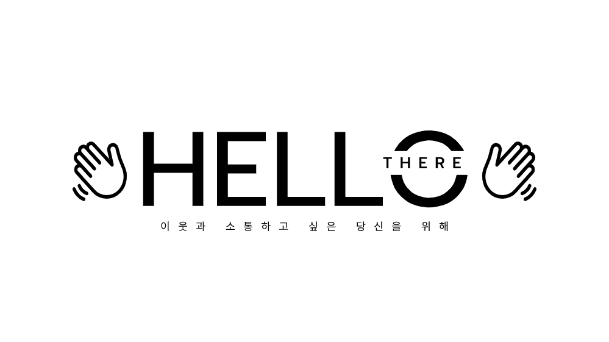
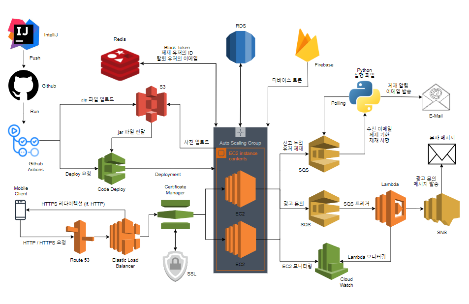
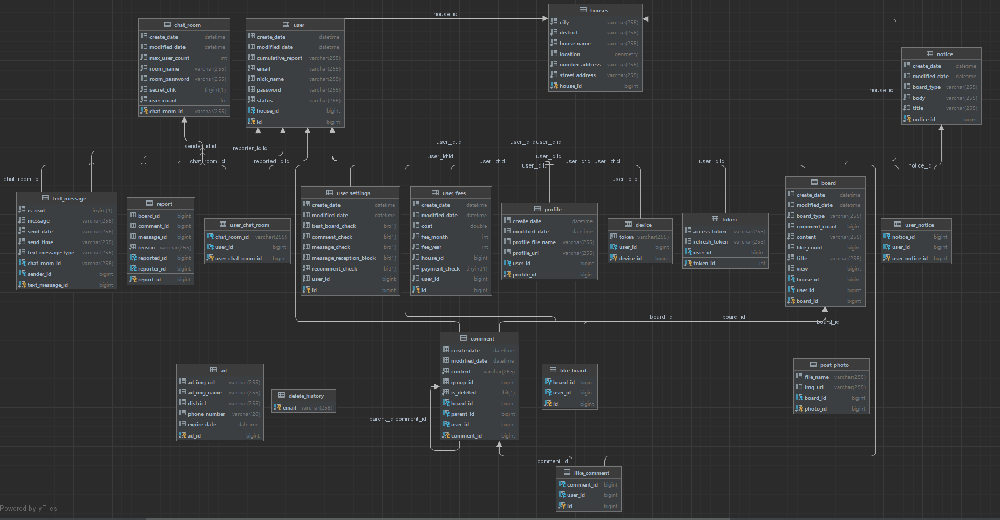

# 🏠 공동 주택 커뮤니티 App - Hello There

**Hello There**는 이웃집 커뮤니티 어플리이션으로, 바람직한 이웃 문화를 장려하기 위해 제작된 서비스입니다. Hello There 어플리케이션은 UMC 4th Study를 수료한 인하대학교, 가톨릭대학교, 한국공학대학교 학생들이 함께 제작하였으며, Project Manager, Designer, FrontEnd, BackEnd로 구성된 총 9명의 팀원이 참여하였습니다.
 
 
## 👨‍🏫 프로젝트 소개
Hello There 어플리케이션의 주요 키워드는 **소통, 연결, 나눔**입니다.
> **소통**: 이웃 간의 불화, 다툼, 언쟁을 해결할 수 있는 소통 창구로써의 역할을 수행합니다.
> 
> **연결**: 정보 및 인테리어 공유, 채팅 등의 서비스를 통해 이웃 간의 원활한 상호 교류를 유도합니다.
> 
> **나눔**: 중고거래, 공동구매 등 이웃 간 공유경제를 활성화 할 수 있는 다양한 서비스를 제공합니다.
 
<h2 id="teamInfo"> 👨‍👨‍👦‍👦 개발자 소개</h2>

<table width="950">
    <thead>
    </thead>
    <tbody>
    <tr>
        <th>사진</th>
        <td width="100" align="center">
            
        </td>
        <td width="100" align="center">
            
        </td>
        <td width="100" align="center">
            
        </td>
        <td width="100" align="center">
            
        </td>
    </tr>
    <tr>
        <th>이름</th>
        <td width="100" align="center">팀장 / 변현섭</td>
        <td width="100" align="center">이다빈</td>
        <td width="100" align="center">송해찬</td>
        <td width="100" align="center">고영우</td>
    </tr>
    <tr>
        <th>역할</th>
        <td width="150" align="center">
            유저, 아파트,  소셜로그인 
        </td>
        <td width="150" align="center">
            게시판, 댓글,  좋아요
        </td>
        <td width="150" align="center">
            게시판, 댓글,  유저 신고
        </td>
        <td width="150" align="center">
            유저, 알림,  아파트
        </td>
    </tr>
    <tr>
        <th>GitHub</th>
        <td width="100" align="center">
            
        </td>
        <td width="100" align="center">
            
        </td>
        <td width="100" align="center">
            
        </td>
        <td width="100" align="center">
            
        </td>
    </tr>
    <tr>
        <th>이메일</th>
        <td width="175" align="center">
            
        </td>
        <td width="175" align="center">
            
        </td>
        <td width="175" align="center">
            
        </td>
        <td width="175" align="center">
            
        </td>
    </tr>
    </tbody>
</table>
 

## ⏲️ 개발 기간 
- **프로젝트 기간**: 2023.07.01(일) ~ 2023.08.23(수)
- **전체 회의**: 매주 월요일 오후 6시
- **Backend 파트 회의**: 매주 일요일 오후 6시
- **FrontEnd & BackEnd 연합 회의**: 매주 수요일 오후 10시
   
   
## 📝 프로젝트 아키텍쳐

## ✒️ 협업 규칙
 **1. 브랜치 전략**: Gihub Flow 전략 사용

 **2. Issue 네이밍 규칙**: 명확한 의도를 나타낼 수 있도록 한글로 작성

 **3. Pull Request 네이밍 규칙**: 
   > 새로운 기능 추가 → feature/기능명 
   > 기존 내용 수정 → refactor/기능명 or fix/issue-#number 
   > 기존 내용 삭제 → remove/기능명 
   > 기능 테스트 → test/기능명 
   > 문서 관련 작업 → document/기능명

 **4. Commit Message 네이밍 규칙**: 이슈 네임과 동일
 
 

## 💻 개발 환경
- **Version** : Java 17, Python 3.10.12
- **IDE** : IntelliJ, Visual Studio Code
- **Framework** : SpringBoot 2.7.11
- **ORM** : JPA
 

## ⚙️ 기술 스택
- **Server**: Java, Python, EC2
- **Load Balancing**: Auto Scaling, ELB
- **DNS**: Route 53, ACM
- **DataBase**: RDS, Datagrip, JPQL, ERD AqueryTool, S3, Redis
- **WS/WAS**: Nginx, Tomcat
- **CI/CD**: Github Actions, CodeDeploy, S3
- **협업 관리**: Notion, Google Meet, Discord, Github, Figma
- **기타**: Firebase, SQS, Lambda, CloudWatch, SNS
 

## 📱 기능 설명 

### ✍ 소셜 로그인 서비스
> ✔ 구글, 네이버, 카카오 계정을 이용한 간편 회원가입 서비스를 제공합니다. 
> ✔ 앱 자체 로그인 기능도 지원합니다.
 

### 🛰️ 본인 주택 등록 서비스
> ✔ GPS를 이용해 본인의 주택을 더욱 편리하게 등록할 수 있습니다. 
> ✔ 본인이 등록한 주택의 커뮤니티로 자동 연결됩니다.
 

### 📝 이웃 게시판 서비스
> ✔ 자유로운 소통을 위한 **자유게시판** 
> ✔ 이웃간의 갈등 해결을 위한 **갈등 소통 게시판** 
> ✔ 거주지 인근의 유용한 정보를 나누는 **정보 공유 게시판** 
> ✔ 공구와 중고 물품을 거래할 수 있는 **공구/중고 게시판** 
> ✔ 인터리어를 공유할 수 있는 **나만의 홈테리어 게시판** 
 

### 👫 실시간 채팅 서비스
> ✔ 게시판에서 알게 된 이웃과 채팅을 실시간으로 주고 받을 수 있습니다. 
> ✔ 개인 및 단체 채팅 기능을 모두 지원합니다.
 

### 🔔 푸시 알림
> ✔ 푸시 알림을 통해 댓글, 대댓글, 인기게시글 선정 등의 푸시 알림을 받을 수 있습니다. 
> ✔ 푸시 알림을 원하지 않을 시 직접 원하는 알림을 On/Off 할 수 있습니다.
 

### 📈 관리비 기록 및 추적
> ✔ 매월 관리비를 기록함으로써, 월별 관리비 사용 내역을 추적할 수 있습니다.
 

### 🔈 지역광고
> ✔ 연락처와 광고 개요만 입력하여 누구나 쉽게 지역광고를 문의할 수 있습니다.
 

### 📣 유저 신고
> ✔ 부적절한 게시글, 댓글, 대댓글, 채팅에 대해 해당 유저를 신고할 수 있습니다. 
> ✔ 누적 신고 횟수 및 신고 종류에 따라 게시글, 채팅, 댓글 기능 이용이 수일 동안 제한됩니다. 
 

**UI/UX 디자인**: <https://www.figma.com/file/9wxIvelTAROHpKgBXLpWsm/UMC4th_HelloThere?type=design&node-id=0-1&mode=design&t=zsw87B0sTsoYX0hm-0>
 
 

<h2 id="erd">🧩 ERD </h2>

 
 

<h2 id="api"> 📌 API </h2>

**API 명세서**: <https://www.notion.so/API-eaf0d2d78321436c9b16bb79c03e228f?pvs=4>

