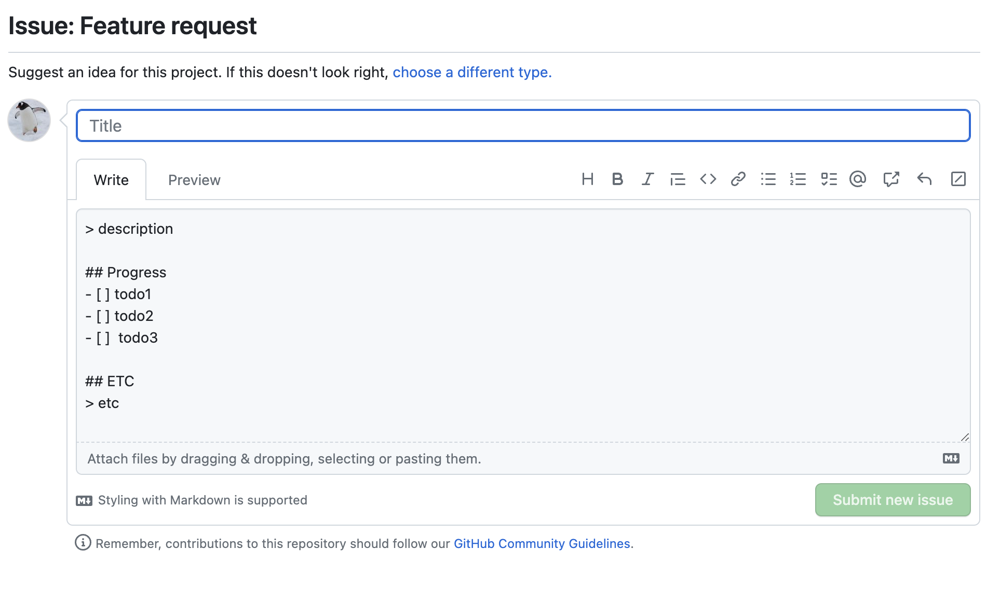
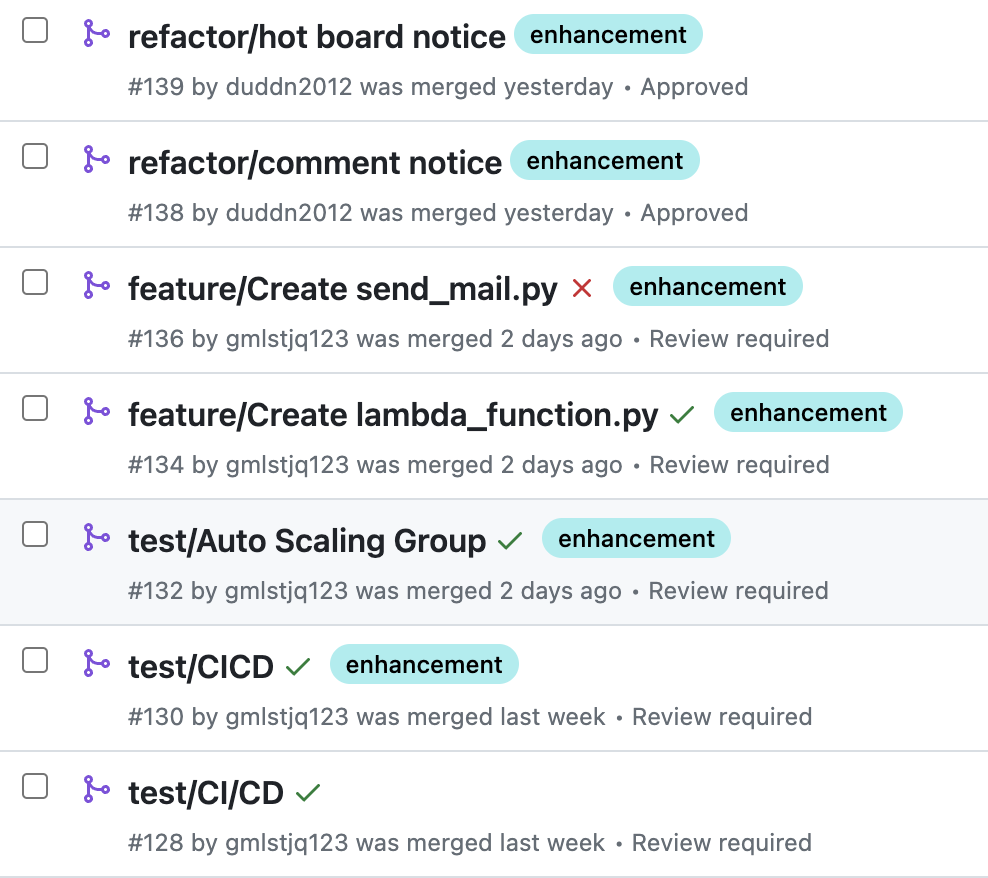

# 🏠 Hello There - 공동주택 커뮤니티

## 프로젝트 소개

### **Hello There**는 이웃간의 소통을 통해 바람직한 이웃 문화의 발전을 위한 앱 서비스입니다.

> 이웃에 무관심한 현대사회에서 서로의 소통은 더욱 힘들어지고 있습니다. **1인 가구의 사회적 고립**은 심화되고있고 **층간 소음**은 사회적 문제로 떠오른지 오래입니다.
>
> Hello There은 **소통, 연결, 나눔**을 키워드로 이웃과의 소통 창구를 만들어 사회적 문제를 해결하고자합니다.

## 📋 목차

<ol>
  <li><a href="#dev">개발 배경</a></li>
  <li><a href="#feature">기능 설명</a></li>
  <li><a href="#figma">피그마</a></li>
  <li><a href="#stacks">기술 스택</a></li>
  <li><a href="#erd">ERD</a></li>
  <li><a href="#api">API 명세서</a></li>
  <li><a href="#cop">협업</a></li>
  <li><a href="#teaminfo">팀 정보</a></li>
</ol>

<h2 id="dev">개발 배경</h2>

Hello There은 UMC 4기 프로젝트 활동으로 시작됐습니다.

> Project Manager, Designer, FrontEnd, BackEnd 총 8명으로 진행했습니다.

### 개발 기간

**23/07/01 ~ 23/08/23**

<h2 id="feature"> 📱 기능 설명 </h2>

### 🧑‍💻 OAuth으로 간편한 소셜 로그인

Spring Security 와 OAuth 기반으로 간편한 소셜로그인이 가능합니다.

> Kakao, Google 로그인 지원

소셜로그인이 아닌 JWT를 이용한 앱 자체 로그인 기능도 지원합니다.

> 리프레시토큰을 이용해 액세스토큰의 보안적 단점을 보완했습니다.

### 🛰️ GPS 기반의 주택 커뮤니티 찾기

**GPS기반으로** 쉽고 간편하게 자신이 속한 주택 커뮤니티에 접속할 수 있습니다.

### 📝 다양한 게시판

- 자유로운 소통을 위한 **자유게시판**
- 이웃간의 갈등 해결을 위한 **갈등 소통 게시판**
- 거주지 인근의 유용한 정보를 나누는 **정보 공유 게시판**
- 공구와 중고 물품을 거래할 수 있는 **공구/중고 게시판**
- 인터리어를 공유할 수 있는 **나만의 홈테리어 게시판**

### 👫 이웃간 실시간 소통 (Chatting)

Hello There은 **1:1채팅 그룹채팅**을 지원합니다.

채팅을 통해 **더 빠르고 유용한 정보**를 나눌 수 있습니다.

### 🔔 푸시 알람

푸시 알람을 통해 사용자는 빠르게 커뮤니티 알람을 받아볼 수 있습니다.

댓글, 대댓글, 인기게시글 선정 등 원하는 알림을 On/Off 할 수 있습니다.

### 📈 관리비 기록 및 추적

매월 관리비를 기록하고 월별 관리비를 추적할 수 있습니다.

### 🔈 지역광고

Hello There의 수익모델입니다.

지역광고를 통해 **지역경제 활성화**를 돕습니다.

<h2 id="figma"> 🎆 피그마</h2>

> 디자이너의 결과물을 팀원 모두 공유하여 의견을 수렴해 진행했습니다.
>
> 이미지 클릭 시 피그마 페이지로 이동합니다.

<h2 id="stacks">⚒️ 기술 스택</h2>

<h3>Java 17, Spring Boot, JPA, MySQL 기반으로 구현</h3>

<h2 id="erd">🧩 ERD </h2>

[상세 DDL 링크](https://www.notion.so/ERD-52815e58621b4947b61ae370f7c0315e?pvs=4)

<h2 id="api"> API </h2>

[API 명세서 링크](https://www.notion.so/API-eaf0d2d78321436c9b16bb79c03e228f?pvs=4)

<h2 id="cop"> 🧑‍💻 협업</h2>

### Issue

> 이슈 템플릿을 이용해 팀원 모두 템플릿을 기반으로 이슈를 작성했습니다.
>
> 이슈 템플릿은 해당 이슈에서 어떤 작업을 처리하는지 이해하기 쉽게 해줍니다.

### Pull Request

> PR 네이밍을 refactor, feature, test, remove 로 시작하여 해당 pr의 목적을 분명히 하도록 했습니다.

<h2 id="teamInfo"> 👨‍👨‍👦‍👦 팀 정보</h2>

<table width="950">
    <thead>
    </thead>
    <tbody>
    <tr>
        <th>사진</th>
        <td width="100" align="center">
            
        </td>
        <td width="100" align="center">
            
        </td>
        <td width="100" align="center">
            
        </td>
        <td width="100" align="center">
            
        </td>
    </tr>
    <tr>
        <th>이름</th>
        <td width="100" align="center">변현섭</td>
        <td width="100" align="center">이다빈</td>
        <td width="100" align="center">송해찬</td>
        <td width="100" align="center">고영우</td>
    </tr>
    <tr>
        <th>역할</th>
        <td width="150" align="center">
            팀장 
            백엔드
        </td>
        <td width="150" align="center">
            백엔드
        </td>
        <td width="150" align="center">
            백엔드
        </td>
        <td width="150" align="center">
            백엔드
        </td>
    </tr>
    <tr>
        <th>GitHub</th>
        <td width="100" align="center">
            
        </td>
        <td width="100" align="center">
            
        </td>
        <td width="100" align="center">
            
        </td>
        <td width="100" align="center">
            
        </td>
    </tr>
    <tr>
        <th>이메일</th>
        <td width="175" align="center">
            
        </td>
        <td width="175" align="center">
            
        </td>
        <td width="175" align="center">
            
        </td>
        <td width="175" align="center">
            
        </td>
    </tr>
    </tbody>
</table>
